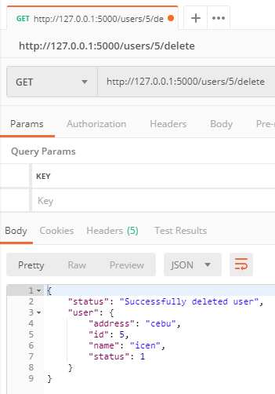

# Python Flask API CRUD  
## Development version  
python v3.7.3    

# Requirements
pip install mysql-connector-python  
pip install -U flask-cors  

# Operations  

* Create  
* Read    
* Update    
* Delete   

# Configure
open `.env` and edit  `LOCALHOST`, `DATABASE`, `USER`, `PASSWORD` and `TABLE_NAME`

# Usage  
```
FLASK_APP=index.py flask run 
```
```
migrate - http://127.0.0.1:5000/migrate
```
```
Create [POST] - http://127.0.0.1:5000/users/create {name:john, address: philippines}
```
```
Read [GET] - http://127.0.0.1:5000/users
```
```
Update [POST] - http://127.0.0.1:5000/users/1/update {name:john, address: philippines}
```
```  
Delete [GET] - http://127.0.0.1:5000/users/1/delete
```
  
# Postman
## Home  
   

## Create  
   

## Read  
   

## Update  
   

## Delete  
   

Use Postman to Test API Request
[Postman](https://www.getpostman.com/)  
